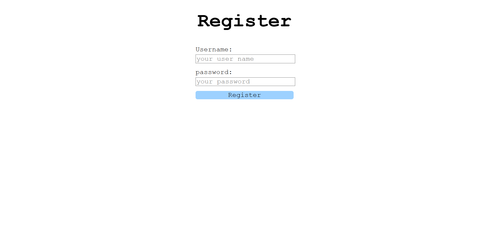
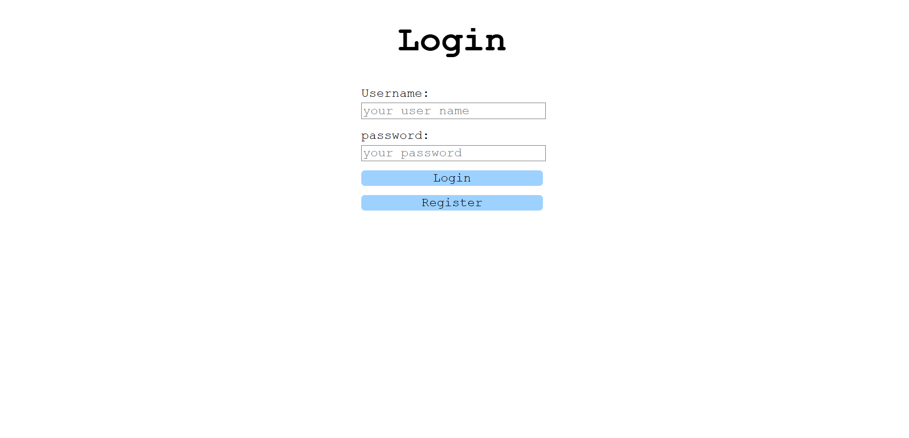
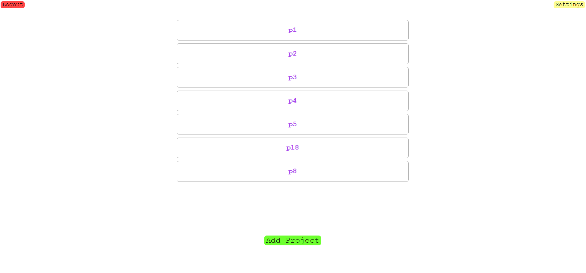
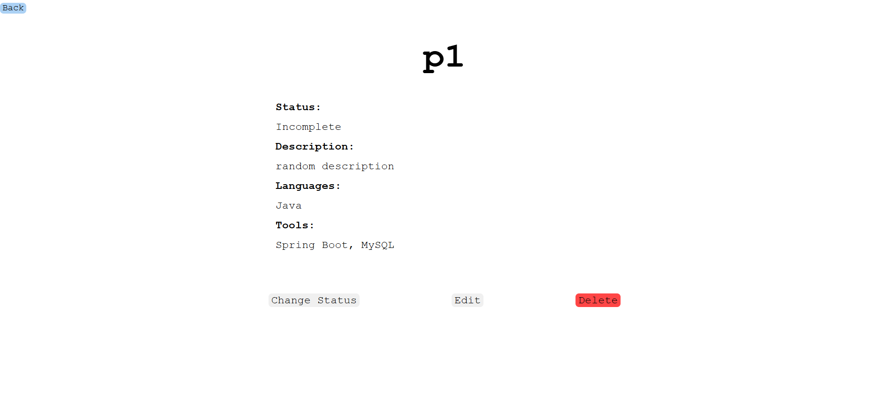
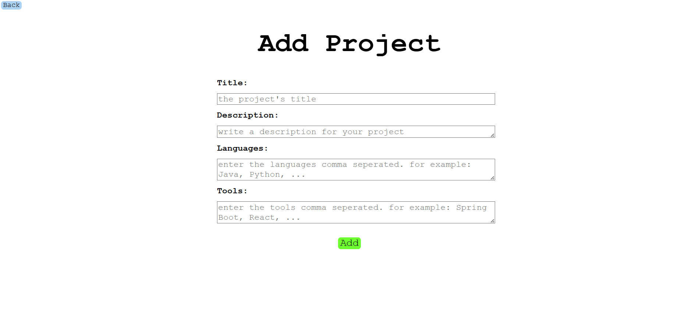
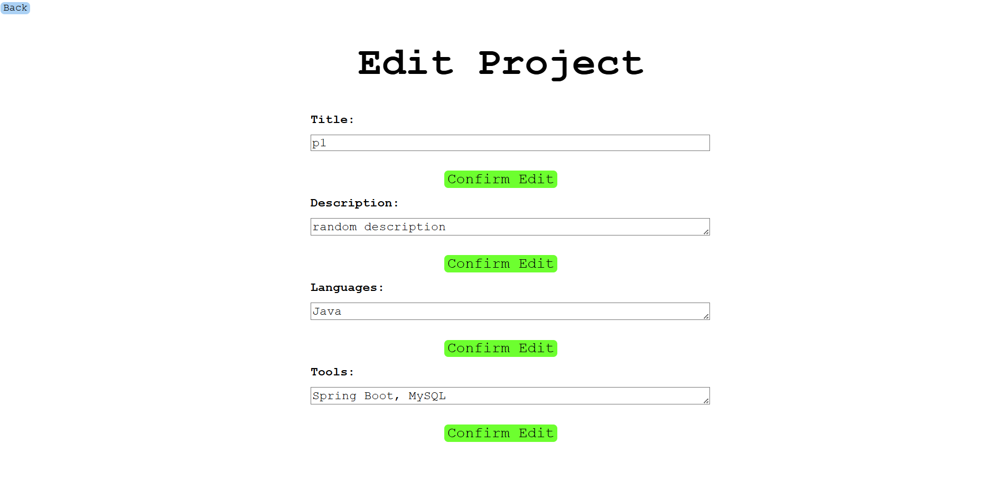
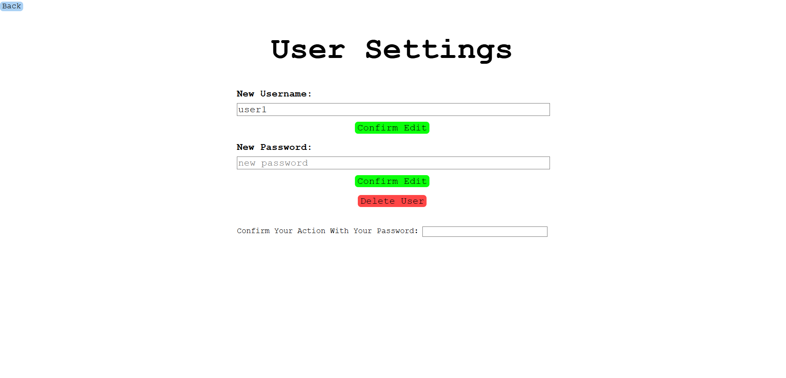

# ProjectManager 🧑🏻‍💼
A Server-Client application to manage personal projects ideas, along with the required programming languages and tools for the development process.


## The System's Components
### Server
A RESTful API server created with Python, Flask, MongoDB, and Anaconda.
<br>
The server supports different users and user management functionality, as well as project ideas management functionality, like reading, creating or updating an idea.
<br>
Endpoints below.

### Client
A web client, created with React.js, to support the server's functionality.
<br>
Screenshots below.


## How To Run
* Server:
    ```bash
    cd Server
    python -u API.py
    ```
* Client:
    ```bash
    cd client
    npm run dev
    ```


## Endpoints
* Register User:
    ```bash
    POST http://<host>:5000/api/register_user
    ```

    Request Body:
    ```bash
    {
        "username": string,
        "password": string
    }
    ```

* Login:
    ```bash
    PATCH http://<host>:5000/api/log_in
    ```
    Request Body:
    ```bash
    {
        "username": string,
        "password": string
    }
    ```

* Logout:
    ```bash
    PATCH http://<host>:5000/api/log_out
    ```
    Request Body:
    ```bash
    {
        "username": string
    }
    ```

* Change Username:
    ```bash
    PATCH http://<host>:5000/api/change_username
    ```
    Request Body:
    ```bash
    {
        "oldUsername": string,
        "newUsername": string,
        "password": string
    }
    ```

* Change Password:
    ```bash
    PATCH http://<host>:5000/api/change_password
    ```
    Request Body:
    ```bash
    {
        "username": string,
        "oldPassword": string,
        "newPassword": string
    }
    ```

* Delete User:
    ```bash
    DELETE http://<host>:5000/api/delete_user
    ```
    Request Body:
    ```bash
    {
        "username": string,
        "password": string
    }
    ```

* Get Project:
    ```bash
    POST http://<host>:5000/api/get_project
    ```
    Request Body:
    ```bash
    {
        "username": string,
        "projectName": string
    }
    ```

* Add Project:
    ```bash
    POST http://<host>:5000/api/add_project
    ```
    Request Body:
    ```bash
    {
        "username": string,
        "projectName": string,
        "description": string,
        "languages": string[],
        "tools": string[]
    }
    ```

* Delete Project:
    ```bash
    DELETE http://<host>:5000/api/delete_project
    ```
    Request Body:
    ```bash
    {
        "username": string,
        "projectName": string,
    }
    ```

* Change Project Name:
    ```bash
    PATCH http://<host>:5000/api/change_project_name
    ```
    Request Body:
    ```bash
    {
        "username": string,
        "projectName": string,
        "newProjectName": string
    }
    ```

* Change Project Description:
    ```bash
    PATCH http://<host>:5000/api/change_project_description
    ```
    Request Body:
    ```bash
    {
        "username": string,
        "projectName": string,
        "description": string
    }
    ```

* Change Project Programming Languages:
    ```bash
    PATCH http://<host>:5000/api/change_project_languages
    ```
    Request Body:
    ```bash
    {
        "username": string,
        "projectName": string,
        "languages": string[]
    }
    ```

* Change Project Development tools:
    ```bash
    PATCH http://<host>:5000/api/change_project_tools
    ```
    Request Body:
    ```bash
    {
        "username": string,
        "projectName": string,
        "tools": string[]
    }
    ```

* Change Project Status:
    ```bash
    PATCH http://<host>:5000/api/mark_project
    ```
    Request Body:
    ```bash
    {
        "username": string,
        "projectName": string
    }
    ```
<br>

## Server Output
The output of the server is always in the following format:

```bash
{
    "value": [the requested value, assuming no exceptions were raised],
    "error": [true if an exception was raised, false otherwise],
    "message": [an error message, if an exception was raised]
}
```
<br>

## Screenshots










